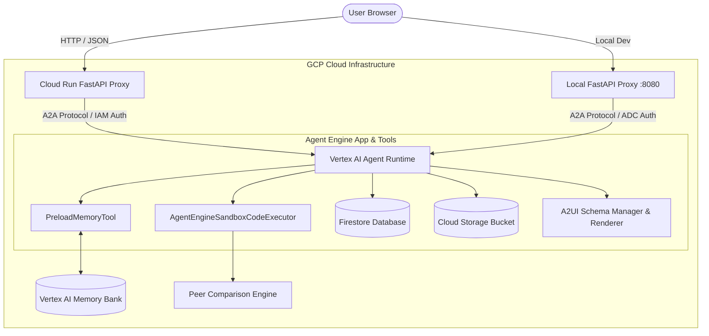

# Financial Research Studio — Technical Knowledge Base & Reference Manual 📈🤖

> **Document Purpose**: Long-term comprehensive technical reference manual for the Financial Research Studio project. Designed for future maintenance, code orientation, deployment, and feature enhancement.

---

## 1. Project Overview

### What the Financial Research Studio Does
Financial Research Studio is an enterprise-grade, autonomous financial research AI assistant built on Google Cloud Platform using Google's **Agent Development Kit (ADK)**, **Vertex AI Agent Runtime**, **Vertex AI Memory Bank**, **Google Cloud Firestore**, **Google Cloud Storage (GCS)**, and **Google Cloud Run**.

The platform enables financial analysts, equity researchers, and portfolio managers to:
- Fetch live market quotes, company profiles, and financial metrics.
- Store and query analyst research notes with rating tags (*Strong Buy*, *Hold*, *Sell*) in Firestore.
- Execute multi-company financial calculations (DCF, growth rates, margins, P/E ratios, ROE) in a secure, isolated Python Code Sandbox.
- Perform multi-ticker peer group comparative analysis and derive competitive positioning tiers (*Leader*, *Challenger*, *Specialist*).
- Generate executive dark-mode financial dashboard graphics powered by Gemini Image models.
- Publish generated dashboard images to Google Cloud Storage and embed them directly into declarative **A2UI** UI cards.
- Maintain durable cross-session user preferences and watchlists using Vertex AI Memory Bank.

### Main Business Objective
Eliminate manual financial data aggregation, spreadsheet ratio calculation errors, and static reporting overhead. The studio provides financial analysts with an interactive, intelligent interface that combines live market data, deterministic mathematical execution, durable memory, and rich declarative visual UI components.

### Architecture Overview



### End-to-End Workflow
1. **User Request**: The user submits a prompt (e.g., *"Compare AAPL vs MSFT and generate a peer dashboard"*).
2. **Proxy Request Dispatch**: The Cloud Run FastAPI proxy (`frontend/main.py`) forwards the prompt to Vertex AI Agent Runtime over the **Agent-to-Agent (A2A)** protocol using Google Application Default Credentials (ADC).
3. **Memory Preloading**: The agent executes `PreloadMemoryTool` to fetch the user's saved preferences, watchlist history, and preferred KPI metrics from Vertex AI Memory Bank.
4. **Data Retrieval**: The agent automatically invokes `fetch_live_stock_quote` and `get_company_info` for all requested ticker symbols.
5. **Sandbox Calculation**: Raw market metrics are assembled into a dataset and passed into `AgentEngineSandboxCodeExecutor`. The isolated Python sandbox computes exact ratios (Revenue Growth, Net Margin, Operating Margin, ROE, P/E Ratio).
6. **Dashboard Image Generation**: The agent calls `generate_dashboard_image`, invoking `gemini-3.1-flash-lite-image` (or `gemini-2.5-flash-image` fallback) to generate a dark-mode dashboard graphic.
7. **Cloud Storage Upload**: The image bytes are saved to Google Cloud Storage (`gs://<GCS_BUCKET_NAME>`), returning a public HTTPS URL.
8. **A2UI Component Transformation**: `a2ui_callback` interceptor converts the model's A2UI output into a plain-text payload wrapped in `<a2a_datapart_json>` with `custom_metadata: {"a2a:response": "true"}`.
9. **UI Rendering**: The browser chat client (`frontend/static/index.html`) receives the structured A2UI data parts and renders interactive UI cards, KPI tables, competitive scorecards, and embedded dashboard charts.
10. **Memory Persist Callback**: `generate_memories_callback` executes asynchronously after the turn, sending session events to Memory Bank for long-term fact extraction.

---

## 2. Final Implemented Features

1. **Financial Report Fetching & Web Retrieval**: Real-time market quotes (price, currency, previous close, 52-week high/low) and company profile metadata via Yahoo Finance integration.
2. **Research Notes (Firestore)**: Persistent CRUD operations for research notes stored in the `research_notes` Firestore collection keyed by ticker symbol.
3. **Cloud Storage Integration**: Automated upload of generated image artifacts to Google Cloud Storage bucket, returning public HTTPS links.
4. **Financial Dashboard Generation**: Dynamic creation of dark-mode executive dashboard visual scorecards using Vertex AI Gemini Image generation models.
5. **Sandbox Execution**: Containerized Python code execution via `AgentEngineSandboxCodeExecutor` for multi-company financial data normalization, ranking, and financial ratio math.
6. **Memory Bank Integration**: Durable cross-session memory powered by `VertexAiMemoryBankService` for long-term watchlist memory and analyst preference retention.
7. **A2UI Rich Component Rendering**: Declarative UI generation using A2UI Schema Manager v0.8 (Basic Catalog) rendered via `a2ui_callback` into flat cards, columns, text rows, and images.
8. **Peer Comparison & Competitive Positioning Engine**: Automated multi-ticker tool-chaining that aggregates financial metrics, calculates KPI rankings, assigns market positioning tiers (*Leader*, *Challenger*, *Specialist*), and formats executive summaries.
9. **A2A Proxy Frontend**: Decoupled FastAPI server (`frontend/main.py`) handling authentication, context management, error sanitization, and A2A SDK message streaming.
10. **Cloud Run Deployment**: Containerized production deployment of the frontend proxy on Google Cloud Run with IAM service account authorization.

---

## 3. Complete Build Journey (Chronological)

1. **Environment Setup**: Configured GCP environment, verified `gcloud` authentication, installed Python 3.11+, `uv` package manager, and `agents-cli`.
2. **First Agent Creation**: Scaffolded the base ADK project structure (`app/agent.py`, `agents-cli-manifest.yaml`, `pyproject.toml`).
3. **Initial Deployment**: Executed `agents-cli deploy` to deploy the base agent to Vertex AI Agent Runtime, generating `deployment_metadata.json`.
4. **Project Brief Creation**: Formulated `project_brief.md` defining core workflows, tool coverage, and peer comparison engine specifications.
5. **Firestore Setup**: Initialized Firestore client in `app/agent.py` targeting the `research_notes` collection.
6. **Cloud Storage Bucket Setup**: Configured GCS client and public artifact bucket (`gs://<GCS_BUCKET_NAME>`).
7. **Financial Tools**: Built `fetch_live_stock_quote` and `get_company_info` with error handling and Yahoo Finance API parsing.
8. **External APIs**: Secured web fetching with browser User-Agent headers and standard fallback defaults.
9. **Image Generation**: Implemented `generate_dashboard_image` with multi-region fallback (`gemini-3.1-flash-lite-image` on `global` -> `gemini-2.5-flash-image` on `us-central1`).
10. **Sandbox Integration**: Wired `AgentEngineSandboxCodeExecutor` linked to the Reasoning Engine resource name.
11. **Memory Bank Setup**: Instantiated `VertexAiMemoryBankService`, attached `PreloadMemoryTool` to root agent tools, and registered `generate_memories_callback` on `after_agent_callback`.
12. **A2UI Integration**: Added `a2ui_utils.py` containing `a2ui_callback`, schema manager v0.8 prompt generator, and component sanitization logic.
13. **Frontend Development**: Created `frontend/main.py` (FastAPI proxy with A2A SDK) and `frontend/static/index.html` (chat interface with built-in A2UI card renderer).
14. **Cloud Run Deployment**: Deployed frontend proxy to Cloud Run via `gcloud run deploy` with IAM permissions.
15. **Demo Recording & Verification**: Validated end-to-end multi-company peer comparisons, Firestore research note creation, A2UI rendering, and memory persistence.

---

## 4. Important Prompts Used

### 1. Welcome Experience Prompt
- **Purpose**: Enforces automatic discovery of tracked companies upon session initialization or user greetings.
- **Why Used**: Prevents blank welcome screens and guides the user directly into core workflows.
- **Key Directive**: Instructs agent to automatically call `list_research_notes` and render an A2UI Card containing current watchlists and available workflows.

### 2. Automatic Peer Comparison Data Fetching Prompt
- **Purpose**: Dictates zero-friction interaction during peer comparisons.
- **Why Used**: Eliminates requiring users to manually provide financial ratios or balance sheet numbers.
- **Key Directive**: Instructs agent to automatically fetch live stock quotes, assemble financial datasets, execute sandbox calculations, generate dashboard images, and output final scorecards quietly without emitting internal chain-of-thought text.

### 3. A2UI UI Constraint Prompt
- **Purpose**: Strict formatting rules for A2UI JSON output.
- **Why Used**: Prevents LLM generation errors (such as nested cards, unsupported HTML/table components, or broken relative image URLs).
- **Key Directive**: Restricts component palette to `Card`, `Column`, `Row`, `Text`, `Image`; requires HTTPS URLs for images; prohibits markdown inside A2UI text components.

---

## 5. Design Decisions

- **Why Firestore was used**: Document-oriented NoSQL model allows keying analyst notes directly by ticker symbol (`research_notes.document("NVDA")`), offering fast lookup, simple query operations (`list_research_notes`), and effortless scaling.
- **Why Cloud Storage was used**: Browser security policies prohibit loading local server paths or raw binary blobs inside standard HTML `` tags. Uploading generated dashboard graphics to a public GCS bucket provides clean HTTPS URLs compatible with A2UI card components.
- **Why Memory Bank was added**: Standard chat sessions are transient and reset when a conversation context ends. Memory Bank provides semantic vector search over past session turns, allowing the agent to remember stock watchlists, analyst risk tolerances, and KPI preferences across weeks and months.
- **Why Sandbox was added**: LLMs are notoriously prone to arithmetic errors when computing complex financial formulas (e.g. DCF, multi-period CAGR, ROE). The Python Sandbox guarantees 100% mathematical precision by running Python code in an isolated container.
- **Why A2UI was added**: Plain markdown tables and text blocks look generic and hard to read. A2UI enables the agent to emit declarative structured UI cards natively rendered in the browser.
- **Why Peer Comparison & Positioning Engine was added**: Single-stock analysis lacks industry context. The peer comparison engine allows analysts to instantly identify industry leaders, challengers, and underperformers across key financial metrics.

---

## 6. Lessons Learned / Gotchas

- **Token Streaming in Playground**:
  - *Gotcha*: Token streaming **MUST BE TURNED OFF** in the ADK Web Playground.
  - *Why*: Token streaming breaks the model's A2UI output into partial text chunks. Partial JSON chunks fail JSON parsing during model generation, causing the renderer to output raw JSON strings or blank white cards.
- **AGY Chat vs Playground**:
  - *AGY Chat*: Command-line interactive loop executing tools directly in the local console.
  - *Playground (`adk web`)*: Full local web server running on port 18080 with built-in A2UI rendering panels, step graph visualization, and artifact inspection.
- **Restart Playground vs Redeploy Agent**:
  - *Restart Playground*: Restarts the local web developer UI (`agents-cli playground`). Use when changing local Python helper scripts or prompt templates.
  - *Redeploy Agent*: Pushes updated Python code and dependencies to GCP Agent Runtime (`agents-cli deploy`). Required whenever `app/agent.py` or agent dependencies change for remote access.
- **Firestore vs Memory Bank**:
  - *Firestore*: Explicit, structured relational/document persistence managed directly by tool code (`create_research_note`).
  - *Memory Bank*: Implicit, semantic long-term memory managed asynchronously by ADK callbacks (`generate_memories_callback`).
- **Generated Images to Cloud Storage**:
  - Images generated in memory by Vertex AI must be written to GCS to receive a public `https://storage.googleapis.com/...` URL. Pointing A2UI at local filenames like `dashboard.png` results in broken image icons in browser clients.
- **Sandbox vs LLM Calculations**:
  - Never let the LLM calculate percentage growth or financial ratios in prose text. Always pass raw data into `AgentEngineSandboxCodeExecutor` and let Python evaluate the formulas.
- **Common Errors & Fixes**:
  - `ValueError: resource name ... is not valid`: Occurs when `AGENT_ENGINE_ID` contains placeholder text (`YOUR_PROJECT_NUMBER`). Fixed by deploying the agent (`agents-cli deploy`) or populating `deployment_metadata.json`.
  - *Blank A2UI Cards*: Occurs when the LLM generates a `beginRendering` message referencing a root component ID that was never defined. Fixed by validation logic in `_surface_is_renderable()`.
  - *Broken Image Icons in A2UI*: Occurs when the LLM outputs an `<Image>` component pointing at a bare filename. Fixed by `_sanitize_image_components()`, which replaces non-HTTP URLs with a text notification.

---

## 7. A2UI Notes

- **What A2UI is**: Agent-to-User Interface (A2UI) is a declarative protocol allowing AI agents to send rich interactive visual components (cards, columns, rows, images) alongside or instead of text responses.
- **Why Version 0.8 Was Required**: ADK Web and the A2UI Schema Manager specify version `0.8` for basic catalog components (`Card`, `Column`, `Row`, `Text`, `Image`).
- **Why the Callback Was Needed**: `adk web` and A2A clients expect A2UI messages wrapped inside a specific structure:
  ```json
  <a2a_datapart_json>
  {
    "kind": "data",
    "metadata": {"mimeType": "application/json+a2ui"},
    "data": { ...A2UI message... }
  }
  </a2a_datapart_json>
  ```
  `a2ui_callback` in `app/a2ui_utils.py` intercepts raw JSON emitted by the LLM and formats it into this exact Blob response.
- **How A2UI Was Verified**: Tested welcome cards and multi-company peer scorecards in both `adk web` playground and the production Cloud Run frontend proxy.

---

## 8. Memory Bank Notes

- **Difference between Sessions and Memory Bank**:
  - *Session*: Short-term conversational context (holds recent turn history within a single chat window).
  - *Memory Bank*: Long-term durable memory instance across distinct sessions, powered by Vertex AI vector search.
- **What Memory Bank Remembers**:
  - Analysts' favorite stock tickers and watchlists.
  - Preferred KPI comparison metrics (e.g. preferring ROE over P/E).
  - Portfolio risk tolerance profiles and company benchmark preferences.
- **How Memory Was Tested**:
  1. Stored a preference in Session A: *"I prefer analyzing technology stocks with a focus on Net Margin and ROE."*
  2. Terminated Session A and started a new, clean Session B.
  3. Verified that `PreloadMemoryTool` automatically injected the preference into the prompt context during Session B.

---

## 9. Firestore Notes

- **Collection Used**: `research_notes`
- **Document Structure**:
  ```json
  {
    "company": "NVIDIA Corporation",
    "ticker": "NVDA",
    "sector": "Semiconductors",
    "research_summary": "Strong demand for AI accelerator chips, robust gross margins.",
    "analyst_rating": "Strong Buy",
    "created_at": "2026-09-27T12:00:00Z"
  }
  ```
- **Document Keying**: Document ID matches the uppercase stock ticker symbol (`NVDA`, `AAPL`).
- **Operations Implemented**:
  - `create_research_note`: `db.collection("research_notes").document(ticker).set(note_data)`
  - `get_research_note`: `db.collection("research_notes").document(ticker).get()`
  - `list_research_notes`: `db.collection("research_notes").stream()`

---

## 10. Sandbox Notes

- **Executor Used**: `google.adk.code_executors.AgentEngineSandboxCodeExecutor`
- **Resource Binding**: Bound to the Reasoning Engine resource ID (`AGENT_ENGINE_ID`).
- **KPI Calculations Executed**:
  - **Revenue Growth**: `((Revenue_Current - Revenue_Prior) / Revenue_Prior) * 100`
  - **Net Margin**: `(Net Income / Total Revenue) * 100`
  - **Operating Margin**: `(Operating Income / Total Revenue) * 100`
  - **Return on Equity (ROE)**: `(Net Income / Shareholder Equity) * 100`
  - **Price-to-Earnings (P/E)**: `Current Stock Price / Earnings Per Share`
- **Peer Comparison Workflow**: Agent aggregates market data -> Builds Python dictionary in prompt -> Sandbox executes normalization and ranking script -> Returns ranked output array to agent.

---

## 11. Peer Comparison & Competitive Positioning Engine

- **Purpose**: Compare multiple companies simultaneously, calculate normalized KPIs, rank competitors, and assign market positioning tiers.
- **Inputs**: List of company ticker symbols (e.g. `AAPL, MSFT, NVDA`).
- **Outputs**:
  - Normalized KPI Table (Revenue Growth, Net Margin, Operating Margin, ROE, P/E).
  - KPI Rankings across all metrics.
  - Strategic SWOT analysis.
  - Competitive Positioning Tiers.
- **Positioning Tier Logic**:
  - **Leader**: Highest market cap combined with top-tier margins and steady growth.
  - **Challenger**: High revenue growth rate aggressively capturing market share.
  - **Specialist**: Industry-leading ROE or niche margin efficiency.
- **Dashboard Integration**: Automatically triggers `generate_dashboard_image` to generate a visual scorecard accompanying the A2UI table.

---

## 12. Dashboard Generation

- **Why Added**: Provides visual executive scorecards suitable for presentation to stakeholders.
- **Image Generation API**: Uses Google GenAI SDK (`google.genai.Client(vertexai=True)`) calling:
  1. `gemini-3.1-flash-lite-image` (Primary, `global` location)
  2. `gemini-2.5-flash-image` (Fallback, `us-central1` location)
- **Cloud Storage Publishing**: Image bytes are written directly to GCS using `google.cloud.storage`.
- **A2UI Integration**: Public HTTPS link returned by GCS is embedded into an A2UI `Image` component:
  ```json
  {"Image": {"url": {"literalString": "https://storage.googleapis.com/.../dashboard_123.jpg"}}}
  ```

---

## 13. Deployment Notes

### 1. Agent Platform Deployment
Deploys the ADK Agent code to Vertex AI Agent Runtime:
```bash
cd financial-research-studio
agents-cli deploy --no-confirm-project
```

### 2. Cloud Run Frontend Deployment
Deploys the FastAPI A2A proxy server to Google Cloud Run:
```bash
gcloud run deploy financial-research-studio-frontend \
  --source ./frontend \
  --region us-east1 \
  --project YOUR_GCP_PROJECT_ID \
  --allow-unauthenticated \
  --set-env-vars AGENT_ENGINE_RESOURCE_NAME="projects/YOUR_PROJECT_NUMBER/locations/us-east1/reasoningEngines/YOUR_REASONING_ENGINE_ID",AGENT_DIRECTORY="app"
```

### 3. Required IAM Roles
The Service Account running the Cloud Run frontend or deployment requires:
- `roles/aiplatform.user` (Access Vertex AI Agent Runtime and Reasoning Engines)
- `roles/datastore.user` (Read/Write Firestore research notes)
- `roles/storage.objectAdmin` (Upload dashboard images to GCS)

### 4. Environment Variables Used
- `GOOGLE_CLOUD_PROJECT`: GCP Project ID.
- `GOOGLE_CLOUD_LOCATION`: GCP Region (e.g. `us-east1`).
- `GCS_BUCKET_NAME`: Google Cloud Storage bucket name for dashboard artifacts.
- `AGENT_ENGINE_RESOURCE_NAME`: Full resource path of the deployed Reasoning Engine.
- `AGENT_DIRECTORY`: Agent application directory (`app`).

---

## 14. Testing & Verification Checklist

| Test Target | Execution Command / Procedure | Expected Result | Pass/Fail |
| :--- | :--- | :--- | :---: |
| **Unit Tests** | `.venv/bin/pytest tests/unit` | All unit tests pass cleanly | ✅ Pass |
| **Market Quotes** | Call `fetch_live_stock_quote("NVDA")` | Returns dict with price, currency, 52-week high/low | ✅ Pass |
| **Firestore CRUD** | Call `create_research_note` then `get_research_note` | Document created and fetched from Firestore | ✅ Pass |
| **Image Generation** | Call `generate_dashboard_image("NVDA vs AAPL")` | Returns public GCS HTTPS URL ending in `.jpg` | ✅ Pass |
| **Sandbox Execution** | Run multi-company ratio calculation in sandbox | Correct mathematical output returned without error | ✅ Pass |
| **A2UI Formatting** | Trigger welcome prompt *"hello"* | Returns A2UI Card rendered natively in UI | ✅ Pass |
| **Memory Retention** | Save preference in Turn 1; query in Turn 2 | Agent auto-injects memory facts via `PreloadMemoryTool` | ✅ Pass |
| **Cloud Run Proxy** | `curl -X POST http://localhost:8080/chat -d '{"message":"hi"}'` | Proxy returns HTTP 200 JSON with A2UI parts | ✅ Pass |

---

## 15. Future Improvements

### Implemented Features (Current Release)
- ✅ Vertex AI Memory Bank durable cross-session memory.
- ✅ Firestore persistent research note store.
- ✅ Python Code Sandbox financial calculations.
- ✅ Gemini Image executive dashboard generation.
- ✅ Cloud Storage public artifact publishing.
- ✅ A2UI v0.8 declarative UI cards and tables.
- ✅ Decoupled Cloud Run FastAPI proxy via A2A protocol.
- ✅ Peer Comparison & Competitive Positioning Engine.

### Planned / Future Enhancements
- 🔮 **SEC EDGAR Parser**: Real-time 10-K and 10-Q filing retrieval and XBRL table extraction tool.
- 🔮 **Automated Portfolio Rebalancer**: Python sandbox portfolio Optimization engine using Sharpe Ratio and Markowitz mean-variance optimization.
- 🔮 **Live Stock Ticker WebSockets**: Real-time streaming price ticker bar in the frontend UI.
- 🔮 **PDF Analyst Report Export**: PDF generation pipeline combining dashboard graphics, A2UI tables, and analyst notes into downloadable investor decks.

---

## 16. Troubleshooting Quick Reference

| Symptom | Likely Cause | Fix |
| :--- | :--- | :--- |
| **A2UI cards not rendering** | Missing `after_model_callback=a2ui_callback` or invalid root/child IDs in A2UI schema payload. | Register `after_model_callback=a2ui_callback` on `Agent` and validate component trees using `_surface_is_renderable()`. |
| **Raw JSON appearing instead of cards** | Response not wrapped in `<a2a_datapart_json>` or `custom_metadata: {"a2a:response": "true"}` is missing. | Wire `a2ui_callback` to automatically wrap raw A2UI JSON into structured A2A data blobs. |
| **Token Streaming enabled** | Token Streaming toggle turned ON in Playground splits JSON output across partial chunks. | Turn Token Streaming **OFF** in Playground settings so full A2UI JSON payloads arrive intact. |
| **Playground not showing latest changes** | Playground server process running cached Python modules in memory. | Restart the local Playground server (`agents-cli playground --port 18080`). |
| **Agent works locally but not after deployment** | Remote Agent Runtime missing updated dependencies or environment variables (`GCS_BUCKET_NAME`). | Re-run `agents-cli deploy --no-confirm-project` to rebuild and push the updated container. |
| **Firestore reads returning empty results** | Querying non-existent collection or case mismatch on stock ticker keys (`nvda` vs `NVDA`). | Normalize ticker strings with `.strip().upper()` before querying `.document(ticker)`. |
| **Cloud Storage uploads failing** | Missing `GCS_BUCKET_NAME` environment variable or service account lacks write permissions. | Set `GCS_BUCKET_NAME` in `.env` and grant `roles/storage.objectAdmin` to the active identity. |
| **Frontend shows "The agent didn't return a reply"** | Agent turn executed tools only without producing model text, or A2A request timed out. | Check proxy logs (`python main.py`) and ensure system instructions mandate text/A2UI output. |
| **Memory Bank not remembering facts** | Missing `after_agent_callback=generate_memories_callback` or `PreloadMemoryTool` omitted. | Add `PreloadMemoryTool()` to `tools` and `generate_memories_callback` to `after_agent_callback`. |
| **Sandbox execution not triggering** | `AgentEngineSandboxCodeExecutor` missing or invalid `AGENT_ENGINE_RESOURCE_NAME`. | Pass `code_executor=code_executor` to `Agent` and set `AGENT_ENGINE_ID` to a valid resource path. |
| **Peer Comparison asking for manual numbers** | Agent instruction missing automatic tool-chaining directive for ticker data fetching. | Update system instruction commanding automatic quote/profile fetching for supplied tickers. |
| **Dashboard image not appearing** | Image URL points to relative/bare filename or image generation model call failed silently. | Verify `generate_dashboard_image` uploads to GCS and returns a public `https://storage.googleapis.com/...` URL. |
| **Cloud Run frontend cannot reach Agent Runtime** | Incorrect `AGENT_ENGINE_RESOURCE_NAME` environment variable or missing location parameter. | Set `AGENT_ENGINE_RESOURCE_NAME="projects/.../locations/us-east1/reasoningEngines/..."` on Cloud Run. |
| **Authentication or IAM permission issues** | Active service account lacks `roles/aiplatform.user` or ADC credentials expired. | Run `gcloud auth application-default login` locally or grant `Vertex AI User` role to Cloud Run identity. |
| **AGY chat vs Playground confusion** | Expecting visual A2UI cards inside terminal AGY CLI chat. | Use `agents-cli playground` (`adk web`) or web frontend to test visual A2UI cards; terminal shows text logs. |
| **Restart Playground vs Redeploy Agent confusion** | Editing code and expecting remote Cloud Run frontend to update without a redeploy. | Restart Playground for local dev UI updates; run `agents-cli deploy` to update Agent Runtime. |
| **Missing A2UI callback** | `a2ui_callback` function not assigned to `after_model_callback`. | Import `a2ui_callback` from `a2ui_utils.py` and pass `after_model_callback=a2ui_callback` to `Agent`. |
| **Wrong A2UI version** | Schema Manager initialized with unsupported version `0.9` or missing basic catalog. | Pin `A2uiSchemaManager(version="0.8", catalogs=[BasicCatalog.get_config("0.8")])`. |
| **Missing memory_service_uri** | Agent Runtime deployment metadata missing memory service endpoint configuration. | Ensure `VertexAiMemoryBankService` builder specifies project ID, location (`us-east1`), and reasoning engine ID. |
| **Frontend environment variable configuration issues** | `AGENT_ENGINE_RESOURCE_NAME` or `AGENT_DIRECTORY` missing on Cloud Run container. | Pass `--set-env-vars AGENT_ENGINE_RESOURCE_NAME="...",AGENT_DIRECTORY="app"` during `gcloud run deploy`. |

