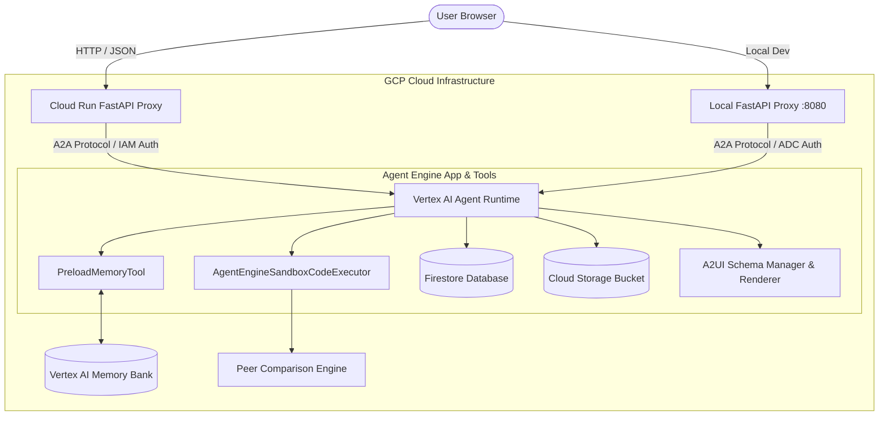

# Financial Research Studio 

**Financial Research Studio** is an enterprise-grade AI assistant built using Google's Agent Development Kit (ADK), Agent Runtime, Vertex AI Memory Bank, and Cloud Run. It automates financial research workflows—fetching live market data, executing Python code in an isolated sandbox, maintaining persistent research notes in Firestore, generating dynamic dashboard visualizations saved to Google Cloud Storage, and rendering rich A2UI cards.

---

##  Architecture Overview

The platform uses a decoupled frontend-to-backend architecture communicating via the Agent-to-Agent (A2A) protocol:



---

##  Implemented Features

###  1. Financial Report Fetching & Web Retrieval
- **Live Stock Quotes**: Fetches real-time price, volume, change, and 52-week ranges (`fetch_live_stock_quote`).
- **Company Profiles**: Retrieves company background, sector, industry, market cap, and fundamentals (`get_company_info`).

###  2. Research Notes (Google Cloud Firestore)
- **Persistent Notes**: Saves research notes with rating tags (e.g. *Strong Buy*, *Hold*) into Firestore (`create_research_note`).
- **Query & List**: Fetches existing company notes (`get_research_note`) or lists all tracked research notes (`list_research_notes`).

###  3. Cloud Storage Integration
- **Public Artifact Buckets**: Dynamically uploads generated visual dashboards to Google Cloud Storage bucket (`gs://financial-research-studio-qwiklabs-gcp-02-a744a4e1b2f4`).
- **HTTPS Serving**: Exposes GCS public URLs directly to the A2UI card renderer.

###  4. Financial Dashboard Generation
- **Automated Charting**: Generates matplotlib/Pillow financial dashboards (`generate_dashboard_image`) comparing revenue, margin trends, and market positioning.
- **Card Embeds**: Embeds dashboard images into A2UI UI cards.

###  5. Vertex AI Memory Bank Integration
- **Cross-Session Memory**: Integrates Vertex AI Memory Bank (`PreloadMemoryTool`) for long-term facts and user preferences.
- **Session Event Callback**: `generate_memories_callback` sends session events after turns to extract durable user facts.

###  6. Python Sandbox Execution
- **Isolated Code Sandbox**: `AgentEngineSandboxCodeExecutor` executes custom Python scripts in a safe, isolated container.
- **Financial Math**: Computes metrics (Revenue Growth, Net Margin, Operating Margin, ROE, P/E Ratios, Earnings Growth).

###  7. A2UI Rich UI Component Rendering
- **Declarative UI**: Uses A2UI v0.8 Basic Catalog (`Card`, `Column`, `Row`, `Text`, `Image`).
- **Unified Rendering**: Works natively in both `adk web` playground and custom web frontends via `a2ui_callback`.

###  8. Peer Comparison & Competitive Positioning Engine
- **Automated Tool-Chaining**: Takes company tickers (e.g., `AAPL vs MSFT`), automatically fetches quotes/profiles, passes dataset to Python sandbox, calculates KPIs, and generates comparison dashboard.
- **Privacy & Clean Output**: Internal reasoning and code execution remain quiet; returns only:
  - Revenue Growth Ranking
  - Net Margin Ranking
  - Operating Margin Ranking
  - ROE Ranking
  - P/E Ranking
  - Competitive Positioning Analysis (*Leader*, *Challenger*, *Specialist*)
  - Executive Summary
  - Dashboard Card Output

###  9. Production Cloud Run Frontend
- **FastAPI Proxy**: Standardized proxy (`frontend/main.py`) running on Google Cloud Run.
- **IAM Authorization**: Uses Service Account credentials with `roles/aiplatform.user` to communicate securely with Agent Runtime over A2A.

---

##  Project Structure

```text
financial-research-studio/
├── app/
│   ├── agent.py               # Core ADK Agent, tools, Memory Bank, & A2UI rules
│   ├── a2ui_utils.py          # A2UI v0.8 schema manager & callbacks
│   ├── fast_api_app.py        # Local FastAPI app entrypoint
│   └── app_utils/             # A2A, Telemetry, and Reasoning Engine adapters
├── frontend/
│   ├── main.py                # FastAPI proxy connecting browser to deployed agent
│   ├── requirements.txt       # Frontend Python dependencies
│   ├── Dockerfile             # Container image for Cloud Run deployment
│   └── static/
│       └── index.html         # Web UI with built-in A2UI card renderer
├── deployment_metadata.json   # Deployed Agent Runtime metadata
├── agents-cli-manifest.yaml   # ADK Manifest
├── pyproject.toml             # Project build configuration
└── README.md                  # System Documentation
```

---

##  Local Setup & Development

### 1. Prerequisites
- Python 3.11+
- `uv` package manager (`pip install uv`)
- Google Cloud SDK (`gcloud`) signed in with appropriate GCP permissions.

### 2. Environment Configuration
Create a `.env` file in the project root:
```bash
GOOGLE_CLOUD_PROJECT="YOUR_GCP_PROJECT_ID"
GOOGLE_CLOUD_LOCATION="us-east1"
MEMORY_BANK_ID="projects/YOUR_PROJECT_NUMBER/locations/us-east1/reasoningEngines/YOUR_MEMORY_BANK_ID"
GCS_BUCKET_NAME="YOUR_GCS_BUCKET_NAME"
```

### 3. Run ADK Playground
Launch the local ADK developer UI to inspect agent step graphs and tools:
```bash
agents-cli playground --port 18080
```
Open local playground: `http://127.0.0.1:18080/dev-ui/?app=app`

### 4. Run Local Frontend Server
Start the local FastAPI proxy server connecting to the deployed Agent Runtime:
```bash
AGENT_ENGINE_RESOURCE_NAME="projects/YOUR_PROJECT_NUMBER/locations/us-east1/reasoningEngines/YOUR_REASONING_ENGINE_ID" \
AGENT_DIRECTORY="app" \
PORT=8080 \
.venv/bin/python frontend/main.py
```
Open local frontend: `http://localhost:8080`

---

##  Cloud Deployment

### 1. Deploy Agent to Agent Platform (Agent Runtime)
```bash
agents-cli deploy --no-confirm-project
```
This updates `deployment_metadata.json` with the active Reasoning Engine resource name.

### 2. Deploy Frontend to Cloud Run
```bash
gcloud run deploy financial-research-studio-frontend \
  --source ./frontend \
  --region us-east1 \
  --project YOUR_GCP_PROJECT_ID \
  --allow-unauthenticated \
  --set-env-vars AGENT_ENGINE_RESOURCE_NAME="projects/YOUR_PROJECT_NUMBER/locations/us-east1/reasoningEngines/YOUR_REASONING_ENGINE_ID",AGENT_DIRECTORY="app"
```

---

## 🔗 Environment & Service Reference

- **Cloud Run Proxy Service**: `https://<YOUR-CLOUD-RUN-SERVICE-URL>.run.app`
- **Agent Runtime Resource**: `projects/YOUR_PROJECT_NUMBER/locations/us-east1/reasoningEngines/YOUR_REASONING_ENGINE_ID`
- **GCS Artifacts Bucket**: `gs://YOUR_GCS_BUCKET_NAME`

